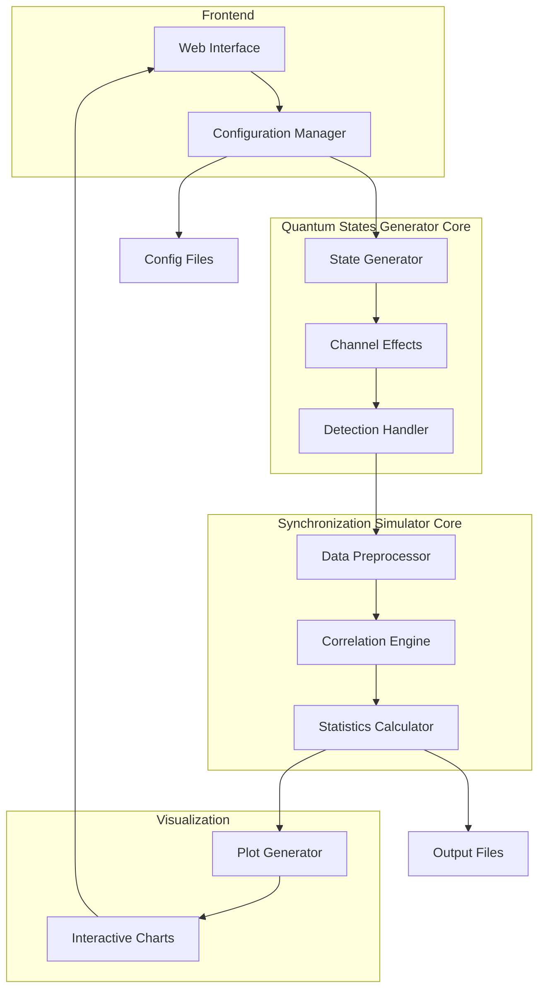

# Quantum Channel Simulation Interface

*This document was created by an AI assistant based on the prompt: "Create a plan and structure for new simulation software with web interface for quantum channel simulation"*

#AI_generated

## Sources
- Project requirements from user prompt
- Best practices for scientific simulation software
- Web interface design patterns
- System architecture documentation

## Overview
This project implements a modular quantum channel simulation system with a web-based user interface. The software allows users to simulate quantum communication scenarios by adjusting parameters related to Alice (sender), Bob (receiver), quantum channel characteristics, and signal processing configurations. The system is split into two main simulation cores for enhanced modularity and testability.

## Architecture



### Components

1. **Web Interface**
   - Parameter input forms grouped by category:
     - Alice parameters
     - Bob parameters
     - Channel characteristics
     - Processing options
   - Interactive scientific charts
   - Real-time parameter validation

2. **Quantum States Generator Core**
   - State generation with configurable properties
   - Channel effects simulation (loss, delay, noise)
   - Detection event handling and recording
   - Modular design for independent testing

3. **Synchronization Simulator Core**
   - Data preprocessing and filtering
   - Correlation analysis engine
   - Statistical calculations and metrics
   - Independent operation with mock data support

4. **Backend System**
   - Configuration file parser/generator
   - Command-line interface
   - Results processing pipeline

5. **Data Flow**
   - Web UI → Configuration file
   - Configuration → Quantum States Generator
   - Generator → Synchronization Simulator
   - Simulator → Results files
   - Results → Visualization

## Implementation Plan

### Phase 1: Basic Interface Development
- Create HTML interface skeleton
- Implement basic parameter input forms
- Set up configuration file format
- Establish basic Python project structure
- Create minimal backend API endpoints

### Phase 2: Core Modules Setup
- Implement Quantum States Generator Core
  - State generation module
  - Channel effects module
  - Detection handling module
- Implement Synchronization Simulator Core
  - Data preprocessing module
  - Correlation engine
  - Statistics calculator

### Phase 3: Module Testing
- Develop mock data generators
- Create unit tests for each module
- Implement integration tests between modules
- Set up automated testing pipeline

### Phase 4: Integration
- Connect Quantum States Generator to Synchronization Simulator
- Implement basic visualization system
- Connect web interface to backend
- End-to-end testing

### Phase 5: Optimization
- Profile and optimize simulation modules
- Implement caching system
- Add parallel processing capabilities

### Phase 6: Interface Refinement
- Enhance parameter input validation
- Add advanced visualization features
- Implement real-time parameter updates
- Add interactive data exploration tools
- Optimize UI/UX based on user feedback

## File Structure
```
project/
├── web/
│   ├── index.html
│   ├── css/
│   └── js/
├── src/
│   ├── quantum_core/
│   │   ├── state_generator.py
│   │   ├── channel_effects.py
│   │   └── detection_handler.py
│   ├── sync_core/
│   │   ├── preprocessor.py
│   │   ├── correlation.py
│   │   └── statistics.py
│   ├── config/
│   └── visualization/
├── tests/
│   ├── quantum_core/
│   ├── sync_core/
│   └── integration/
└── docs/
```

## Usage
1. Web Interface: Open index.html in a browser
2. Command Line: `python simulate.py --config input.yaml`
3. Configuration files: YAML format with parameter definitions
4. Mock Data Generation: `python generate_mock.py --type [quantum|sync]`

## Development
- Python 3.8+
- Modern web browser with JavaScript enabled
- Scientific Python libraries (numpy, scipy)
- Visualization libraries (plotly/chart.js)
- Testing frameworks (pytest)

## Testing
- Unit tests for each module
- Mock data generators for independent testing
- Integration tests between cores
- End-to-end tests for web interface

## Future Enhancements
- GPU acceleration support
- Additional visualization options
- Real-time simulation updates
- Parameter optimization tools
- Extended mock data generation
- Automated performance benchmarking