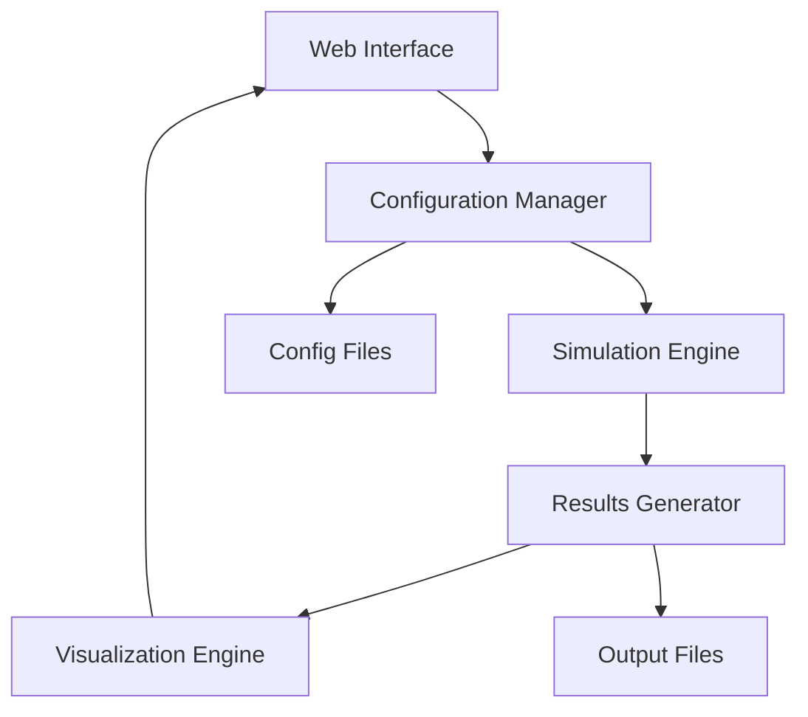

# Quantum Channel Simulation Interface

*This document was created by an AI assistant based on the prompt: "Create a plan and structure for new simulation software with web interface for quantum channel simulation"*

#AI_generated

## Sources
- Project requirements from user prompt
- Best practices for scientific simulation software
- Web interface design patterns

## Overview
This project implements a modular quantum channel simulation system with a web-based user interface. The software allows users to simulate quantum communication scenarios by adjusting parameters related to Alice (sender), Bob (receiver), quantum channel characteristics, and signal processing configurations.

## Architecture



### Components

1. **Web Interface**
   - Parameter input forms grouped by category:
     - Alice parameters
     - Bob parameters
     - Channel characteristics
     - Processing options
   - Interactive scientific charts
   - Real-time parameter validation

2. **Backend System**
   - Modular Python simulation engine
   - Configuration file parser/generator
   - Command-line interface
   - Results processing pipeline

3. **Data Flow**
   - Web UI → Configuration file
   - Configuration → Simulation engine
   - Simulation → Results files
   - Results → Visualization

## Implementation Plan

### Phase 1: Basic Structure
- Create HTML interface skeleton
- Implement configuration file format
- Set up basic Python project structure

### Phase 2: Core Functionality
- Develop simulation modules
- Implement configuration parser
- Create command-line interface

### Phase 3: Integration
- Connect web interface to backend
- Implement visualization system
- Add real-time parameter updates

### Phase 4: Optimization
- Profile and optimize simulation modules
- Implement caching system
- Add parallel processing capabilities

## File Structure
```
project/
├── web/
│   ├── index.html
│   ├── css/
│   └── js/
├── src/
│   ├── simulation/
│   ├── config/
│   └── processing/
├── tests/
└── docs/
```

## Usage
1. Web Interface: Open index.html in a browser
2. Command Line: `python simulate.py --config input.yaml`
3. Configuration files: YAML format with parameter definitions

## Development
- Python 3.8+
- Modern web browser with JavaScript enabled
- Scientific Python libraries (numpy, scipy)
- Visualization libraries (plotly/chart.js)

## Testing
- Unit tests for simulation modules
- Integration tests for configuration system
- End-to-end tests for web interface

## Future Enhancements
- GPU acceleration support
- Additional visualization options
- Real-time simulation updates
- Parameter optimization tools