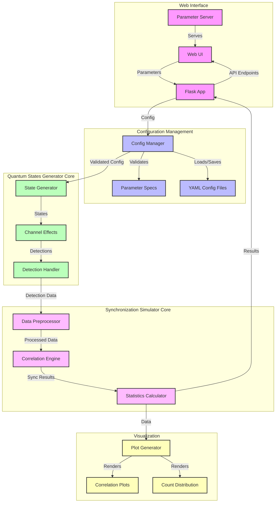

# System Architecture

This document was created by an AI.
Original prompt: Modify the system architecture to separate the Quantum Channel Simulator Core into two distinct modules
#AI_generated

Sources:
- src/main.py
- src/app.py
- src/parameter_server.py
- src/config/parameter_handler.py
- src/simulation/quantum_channel.py

## System Block Diagram

## Component Description

### 1. Web Interface Layer
- [`parameter_server.py`](../src/parameter_server.py) serves the parameter input interface
- [`app.py`](../src/app.py) provides REST API endpoints for simulation control
- Web UI allows parameter input and visualization of results

### 2. Configuration Management Layer
- [`parameter_handler.py`](../src/config/parameter_handler.py) handles parameter validation and configuration
- Manages parameter specifications and constraints
- Handles YAML config file operations

### 3. Quantum States Generator Core
- Components:
  - State Generator: Creates signal and decoy states with specified properties
  - Channel Effects: Applies loss, delay, and noise to quantum states
  - Detection Handler: Simulates Bob's detection system and records events
- Responsibilities:
  - Generation of quantum states with configurable properties
  - Simulation of channel effects and losses
  - Detection event recording and timestamping
  - Output format: Structured detection events data

### 4. Synchronization Simulator Core
- Components:
  - Data Preprocessor: Prepares detection data for correlation analysis
  - Correlation Engine: Performs timing synchronization algorithms
  - Statistics Calculator: Computes QBER and other metrics
- Responsibilities:
  - Processing of raw detection events
  - Time correlation analysis
  - Synchronization optimization
  - Statistical analysis and metrics calculation

### 5. Visualization Layer
- [`generate_plots.py`](../src/generate_plots.py) handles data visualization
- Produces correlation plots and count distributions
- Supports both interactive display and file output

## Development Plans

### Quantum States Generator Core Development Plan

1. State Generator Module
   - Input Interface:
     - Configuration parameters for state properties
     - Timing and pulse parameters
   - Components:
     - State property calculator
     - Timing sequence generator
     - Pulse shape modulator
   - Testing Strategy:
     - Unit tests with mock quantum states
     - Property validation tests
     - Timing sequence verification

2. Channel Effects Module
   - Input Interface:
     - Raw quantum states
     - Channel parameters (loss, noise, etc.)
   - Components:
     - Loss calculator
     - Noise injector
     - Delay simulator
   - Testing Strategy:
     - Channel effect verification tests
     - Loss model validation
     - Statistical distribution tests

3. Detection Handler Module
   - Input Interface:
     - Processed quantum states
     - Detector parameters
   - Components:
     - Detection probability calculator
     - Timestamp generator
     - Event recorder
   - Testing Strategy:
     - Detection statistics validation
     - Timestamp accuracy tests
     - Data format verification

### Synchronization Simulator Core Development Plan

1. Data Preprocessor Module
   - Input Interface:
     - Raw detection events data
     - Processing parameters
   - Components:
     - Data format converter
     - Time bin allocator
     - Filter implementation
   - Testing Strategy:
     - Data format validation tests
     - Filter effectiveness tests
     - Performance benchmarks

2. Correlation Engine Module
   - Input Interface:
     - Preprocessed detection data
     - Correlation parameters
   - Components:
     - Cross-correlation calculator
     - Peak detector
     - Optimization algorithm
   - Testing Strategy:
     - Correlation accuracy tests
     - Known pattern recognition
     - Performance scaling tests

3. Statistics Calculator Module
   - Input Interface:
     - Correlation results
     - Statistical parameters
   - Components:
     - QBER calculator
     - Rate estimator
     - Error analyzer
   - Testing Strategy:
     - Statistical validity tests
     - Edge case handling
     - Accuracy verification

## Testing Strategy

### Module Independence Testing
1. State Generator Testing
   - Use predefined state configurations
   - Verify state properties
   - Test with boundary conditions

2. Channel Effects Testing
   - Use mock quantum states
   - Validate channel transformations
   - Test extreme parameter cases

3. Detection Handler Testing
   - Use simulated channel output
   - Verify detection statistics
   - Test timestamp generation

4. Data Preprocessor Testing
   - Use mock detection data
   - Validate preprocessing steps
   - Test data format conversions

5. Correlation Engine Testing
   - Use synthetic data sets
   - Verify correlation algorithms
   - Test synchronization accuracy

6. Statistics Calculator Testing
   - Use known result sets
   - Validate statistical calculations
   - Test error handling

### Integration Testing
1. Generator-Channel Integration
   - Test state propagation
   - Verify property preservation
   - Validate combined effects

2. Channel-Detection Integration
   - Test detection response
   - Verify timing accuracy
   - Validate event recording

3. Preprocessor-Correlation Integration
   - Test data flow
   - Verify correlation input/output
   - Validate processing chain

4. Full System Integration
   - End-to-end testing
   - Performance validation
   - System stability verification

## Data Flow
1. User inputs parameters through web interface
2. Parameters are validated by Config Manager
3. Quantum States Generator Core simulates quantum state transmission
4. Detection events are passed to Synchronization Simulator Core
5. Results are calculated and sent back to web interface
6. Visualization layer renders plots of results

The system uses a highly modular architecture that separates concerns between quantum state generation, synchronization analysis, and visualization. Each module can be developed and tested independently using mock data or simplified processes.